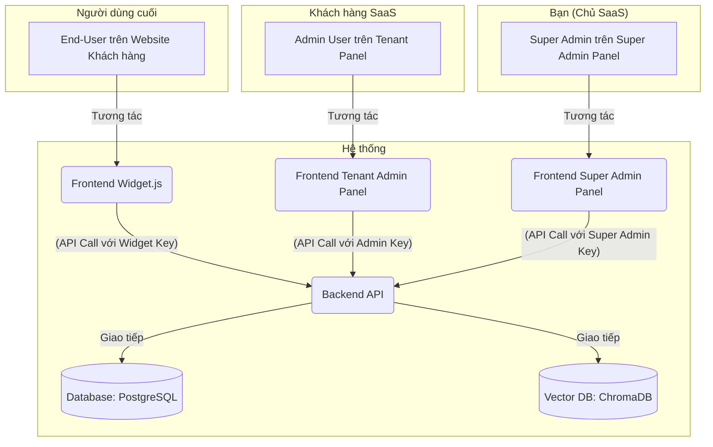
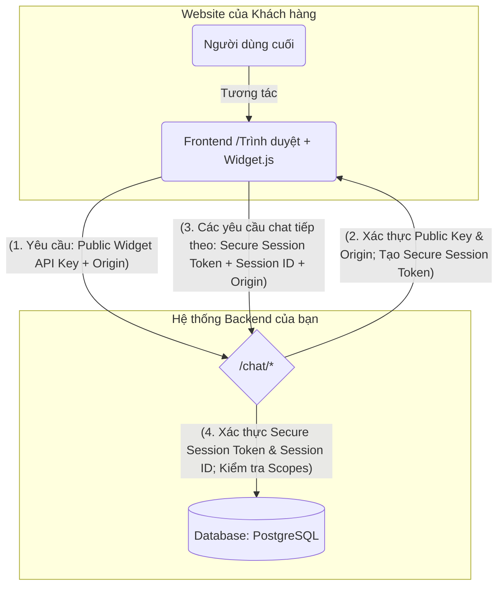

<!-- AI-HUMAN: Tổng quan về hệ sinh thái SaaS AI Chatbot và hướng dẫn chung. -->

# Tổng quan về Hệ sinh thái SaaS AI Chatbot

Hệ sinh thái được thiết kế theo kiến trúc phân tán, bao gồm nhiều thành phần độc lập để đảm bảo tính bảo mật, khả năng mở rộng và dễ dàng quản lý.

## 1. Các Thành phần chính

Hệ sinh thái bao gồm 4 dự án/repository chính, được tách biệt rõ ràng về chức năng.

### 1.1. API - Flow - RAG Backend

Đây là trái tim của hệ thống, chịu trách nhiệm cho tất cả các logic AI và xử lý nghiệp vụ cốt lõi.

- **Chức năng:** Cung cấp API cho các client, điều phối luồng hội thoại (RAG), quản lý việc giao tiếp với các nhà cung cấp LLM và Vector DB.
- **Công nghệ:** Node.js, Fastify, TypeScript, PocketFlow, ChromaDB.
- **Kiến trúc:** Xây dựng theo mô hình module hóa, tập trung vào khả năng mở rộng và tách biệt rõ ràng các thành phần (services, repositories). Điều này giúp hệ thống không chỉ dễ bảo trì mà còn sẵn sàng cho việc tách các chức năng cốt lõi (như quản lý user, chat history) thành các microservice riêng biệt khi cần thiết.

### 1.2. Super Admin Panel (Dành cho Chủ SaaS)

Đây là bảng điều khiển quản trị cấp cao nhất, **chỉ dành cho đội ngũ nội bộ**.

- **Chức năng:** Quản lý toàn bộ hệ thống, bao gồm:
  - Tạo và quản lý tài khoản khách hàng (tenants).
  - Quản lý các gói dịch vụ và thanh toán.
  - Xem tổng số liệu phân tích toàn hệ thống.
  - Cấu hình các thiết lập toàn cục.
- **Kiến trúc:** Là một dự án frontend riêng biệt, giao tiếp với Backend API thông qua một **Super Admin API Key** đặc biệt.

### 1.3. Tenant Admin Panel (Dành cho Khách hàng)

Đây là bảng điều khiển mà **khách hàng của bạn** sẽ sử dụng hàng ngày.

- **Chức năng:** Cho phép khách hàng tự quản lý chatbot của riêng họ:
  - Cấu hình hành vi của chatbot (ví dụ: `systemPrompt`).
  - Quản lý và tải lên tài liệu để chatbot học (dữ liệu cho RAG).
  - Xem lịch sử và phân tích các cuộc hội thoại của _chính họ_.
  - Quản lý API key cho widget và các thiết lập bảo mật (ví dụ: domain được phép).
- **Kiến trúc:** Là một dự án frontend riêng biệt, có hệ thống đăng nhập (email/password) riêng cho người dùng của khách hàng.

### 1.4. Frontend Widget.js (Dự án hiện tại)

Đây là thành phần hiển thị trên website của khách hàng.

- **Chức năng:** Cung cấp giao diện chat để người dùng cuối tương tác. Gửi tin nhắn đến Backend API và hiển thị câu trả lời.
- **Kiến trúc:** Một thư viện JavaScript nhẹ, được nhúng vào website của khách hàng thông qua thẻ `<script>`.

---

## 2. Luồng Dữ liệu và Trách nhiệm

### 2.1. Sơ đồ Luồng Dữ liệu

### 2.2. Luồng Xác thực Widget (Mới)

Để tăng cường bảo mật và đơn giản hóa việc tích hợp cho khách hàng, `widget.js` sử dụng cơ chế xác thực hai bước:

1.  **Public Widget API Key (Publishable Key):**

    - Được tạo từ Tenant Admin Panel, key này được nhúng trực tiếp vào `widget.js` hoặc cấu hình khi nhúng script.
    - Key này **không phải là bí mật** và chỉ có một quyền hạn duy nhất: `session:initiate` (khởi tạo phiên).
    - Nó được sử dụng cho yêu cầu đầu tiên đến Backend API để lấy Secure Session Token.

2.  **Secure Session Token (JWT) ngắn hạn:**
    - Sau khi Public Widget API Key được xác thực, Backend API sẽ trả về một Secure Session Token (JWT) có thời gian sống ngắn (ví dụ: 1 giờ) và được ký bằng khóa bí mật của Backend.
    - Token này chứa các thông tin cần thiết như `sessionId`, `ownerId`, `origin` và các `scopes` cho phép thực hiện các hành động chat.
    - `widget.js` sẽ lưu trữ token này (ví dụ: trong `sessionStorage`) và sử dụng nó cho tất cả các yêu cầu API tiếp theo.

**Luồng xác thực chi tiết:**

### 2.3. Bảng Tóm tắt Trách nhiệm Lưu trữ Dữ liệu (Cập nhật)

| Loại Dữ Liệu                                                 | Nơi Lưu Trữ Chính              | Bên Nào Chịu Trách Nhiệm Ghi                           |
| :----------------------------------------------------------- | :----------------------------- | :----------------------------------------------------- |
| **Tài khoản Khách hàng (Tenants)**                           | Database (PostgreSQL)          | **Super Admin Panel**                                  |
| **Cấu hình Chatbot** (system prompt, etc.)                   | Database (PostgreSQL)          | **Tenant Admin Panel**                                 |
| **API Keys** (Public Widget & Admin)                         | Database (PostgreSQL)          | **Tenant Admin Panel**                                 |
| **Dữ liệu Vector cho RAG**                                   | Vector DB (ChromaDB)           | **Tenant Admin Panel** (tải lên) & **Backend** (xử lý) |
| **Tóm tắt Lịch sử Chat**                                     | Database (PostgreSQL)          | **Backend** (tự động)                                  |
| **Thông tin Phiên Chat** (Session ID đã ký, Origin, Hết hạn) | Database (PostgreSQL)          | **Backend** (tự động)                                  |
| **Lịch sử Chat (phiên hiện tại)**                            | Trình duyệt (`sessionStorage`) | **Widget.js**                                          |
