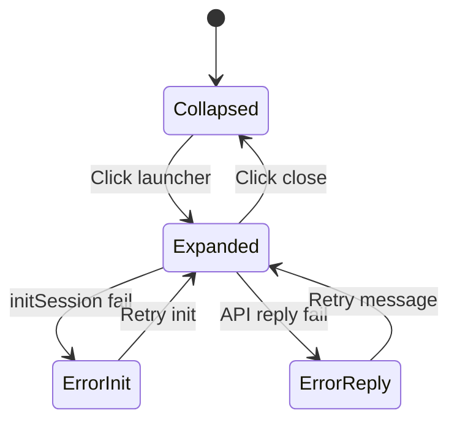

# 🧩 Chat Widget – Mô tả hành vi chi tiết

## 🔷 1. Tổng quan

Widget chat nằm ở góc phải dưới màn hình, ban đầu chỉ hiển thị **nút launcher hình tròn**. Sau vài giây không tương tác, **auto hiện message chào nhỏ**. Khi người dùng nhấn nút, mở ra cửa sổ chat với tin nhắn chào mừng và các nút câu hỏi gợi ý. Nếu có lỗi trong quá trình khởi tạo hoặc gửi yêu cầu, widget hiển thị **nút “Thử lại”** để người dùng retry hành động vừa thất bại.

---

## 🔷 2. Cấu trúc component

```
<ChatWidget>
├── <ChatLauncherButton>      // Icon tròn
├── <TeaserMessage>           // Chào nhỏ sau delay
└── <ChatBox>                 // Cửa sổ chat khi mở
     ├── <ChatHeader>         // Tên + nút thu gọn
     ├── <ChatBody>           // Danh sách message
     ├── <QuickReplies>       // Nút gợi ý câu hỏi
     ├── <InputBox>           // Nhập câu hỏi
     └── <ChatErrorBanner>    // (nếu có lỗi)
```

---

## 🔷 3. Trạng thái UI

| State                    | UI hiển thị                       | Mô tả                      |
| ------------------------ | --------------------------------- | -------------------------- |
| `collapsed` _(mặc định)_ | Launcher button + teaser (sau 3s) | Trạng thái chờ             |
| `expanded`               | Chat box đầy đủ                   | Khi người dùng bấm vào nút |
| `error:init`             | Tin lỗi + nút "Thử lại"           | Khi `initSession()` lỗi    |
| `error:reply`            | Tin lỗi + nút "Thử lại"           | Khi API phản hồi lỗi       |

---

## 🔷 4. Hành vi theo dòng thời gian

## ⏱ Khi trang vừa load:

1. Hiện `<ChatLauncherButton>`
2. Sau 3 giây, nếu chưa mở chat → hiện `<TeaserMessage>`:

   - Ví dụ: “Xin chào! Tôi có thể giúp gì?”

## 🤖 Khi người dùng nhấn nút:

1. Mở `<ChatBox>`
2. Gọi `initSession()` để tạo/kết nối phiên
3. Nếu thành công:

   - Gửi tin nhắn chào: “Xin chào! Tôi có thể giúp gì?”
   - Hiện `<QuickReplies>`: \["Giá dịch vụ", "Tính năng", ...]

4. Nếu lỗi:

   - Hiện `<ChatErrorBanner>`: “Không thể khởi tạo phiên”
   - Kèm nút **"Thử lại"** → gọi lại `initSession()`

## 💬 Khi gửi câu hỏi:

1. Gửi message đến API
2. Nếu lỗi:

   - Hiện `<ChatErrorBanner>`: “Không nhận được phản hồi”
   - Kèm nút **"Thử lại"** → gửi lại prompt vừa rồi

---

## 🔷 5. Mô hình trạng thái (State flow)



---

## 🔷 6. JSON mô tả cấu hình hành vi

```json
{
  "teaserDelay": 3000,
  "states": {
    "collapsed": {
      "ui": ["launcher", "teaser (after delay)"],
      "onClick": "expanded"
    },
    "expanded": {
      "ui": ["chatbox", "quickReplies"],
      "onInitFail": "error:init",
      "onApiFail": "error:reply"
    },
    "error:init": {
      "message": "Không thể khởi tạo phiên",
      "retry": "initSession"
    },
    "error:reply": {
      "message": "Không nhận được phản hồi",
      "retry": "resendLastPrompt"
    }
  }
}
```
